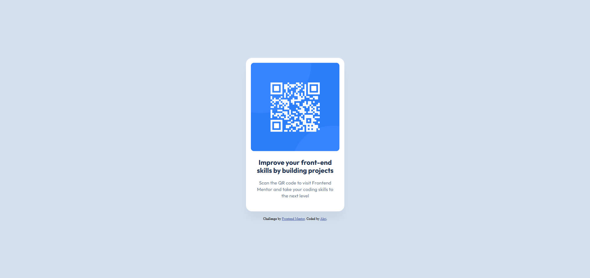

# Frontend Mentor - QR code component solution

This is a solution to the [QR code component challenge on Frontend Mentor](https://www.frontendmentor.io/challenges/qr-code-component-iux_sIO_H). Frontend Mentor challenges help you improve your coding skills by building realistic projects. 

## Table of contents

- [Overview](#overview)
  - [Screenshot](#screenshot)
  - [Links](#links)
- [My process](#my-process)
  - [Built with](#built-with)
  - [What I learned](#what-i-learned)
  - [Continued development](#continued-development)
  - [Useful resources](#useful-resources)
- [Author](#author)

## Overview

### Screenshot



### Links

- [Solution URL](https://www.frontendmentor.io/solutions/qr-code-component-using-css-custom-properties-M-Ih3e0ER3)
- [Live Site URL](https://akri-dev.github.io/frontend-mentor_qr-code-component/)

## My process

### Built with

- Semantic HTML5 markup
- CSS custom properties
- Flexbox
- Mobile-first workflow

### What I learned

I chose this challenge to specifically learn and use CSS Custom Properties

```css
:root{
    --clr-slate-900: #1F314F;
    --clr-slate-500: #68778D;
    --clr-slate-300: #D5E1EF;

    --clr-white: #FFFFFF;

    --spacing-500: 40px;
    --spacing-300: 24px;
    --spacing-200: 16px;
}
```
Made me realize that alongside having CSS Custom Properties, a website should have a good Design System

### Continued development

To continue, my learning path will move towards learning [Tailwind CSS](https://www.youtube.com/watch?v=lCxcTsOHrjo)

### Useful resources

- [Learn CSS Variables In 7 Minutes (Youtube Video)](https://www.youtube.com/watch?v=5wLrz_zUwoU) - This helped me easily understand CSS Custom Properties and how to apply it

## Author

- Website - [Personal Portfolio](https://akri-dev.github.io/av-portfolio/)
- Frontend Mentor - [@akri-dev](https://www.frontendmentor.io/profile/akri-dev)